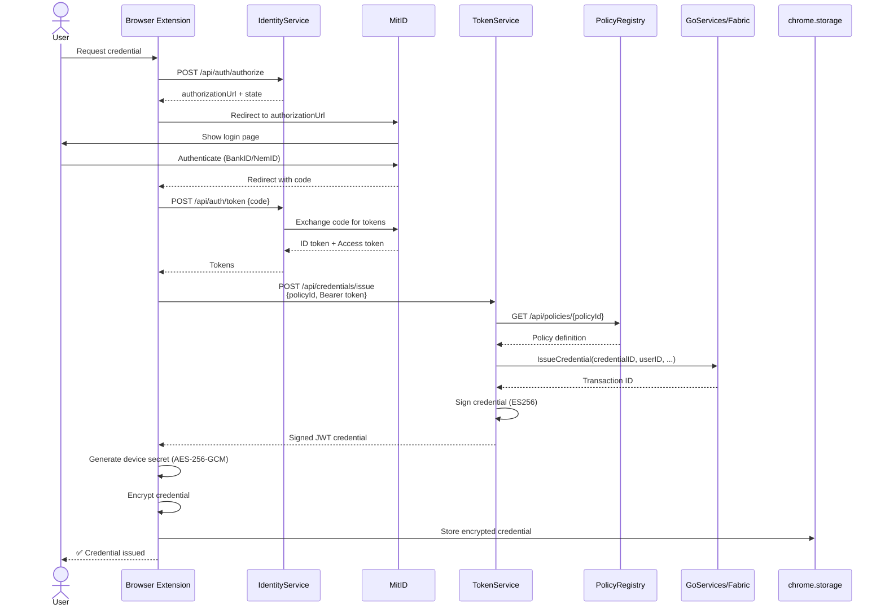
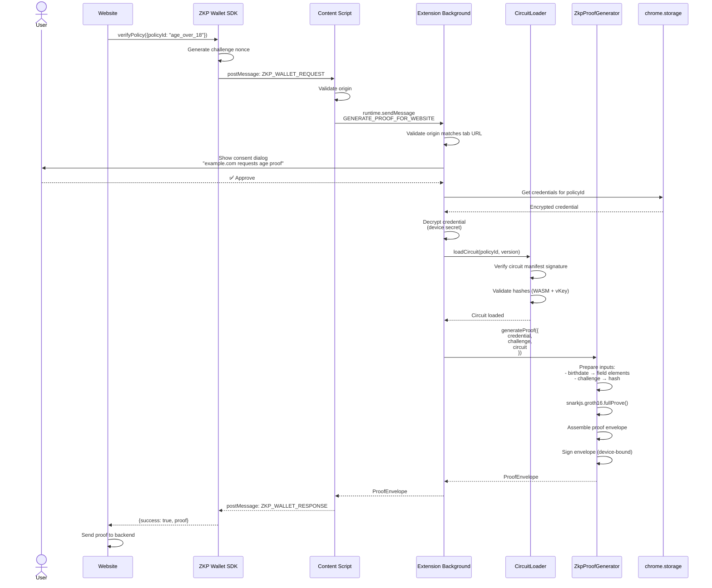
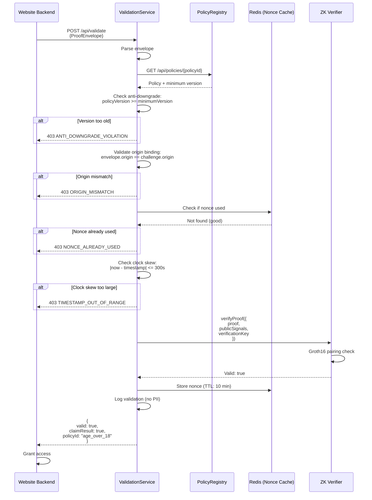
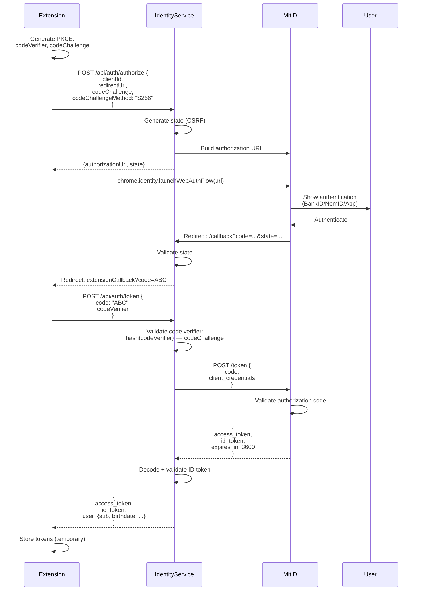
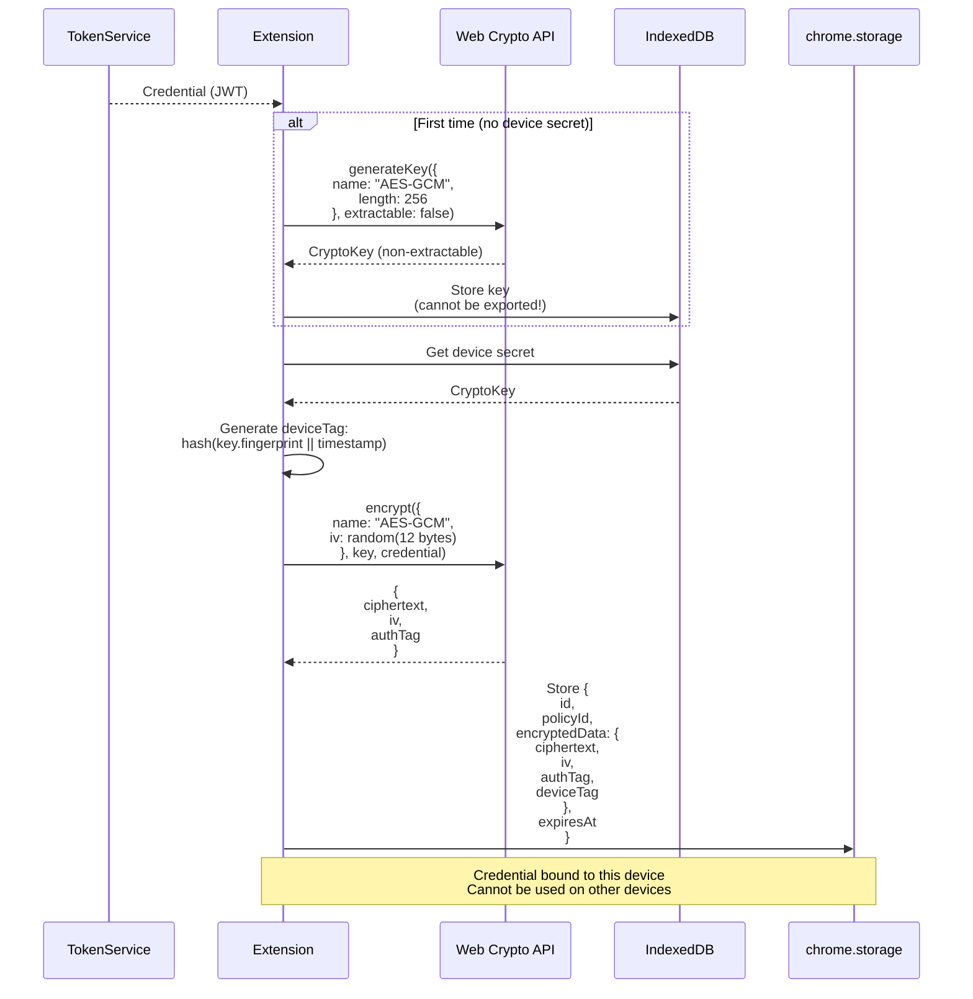
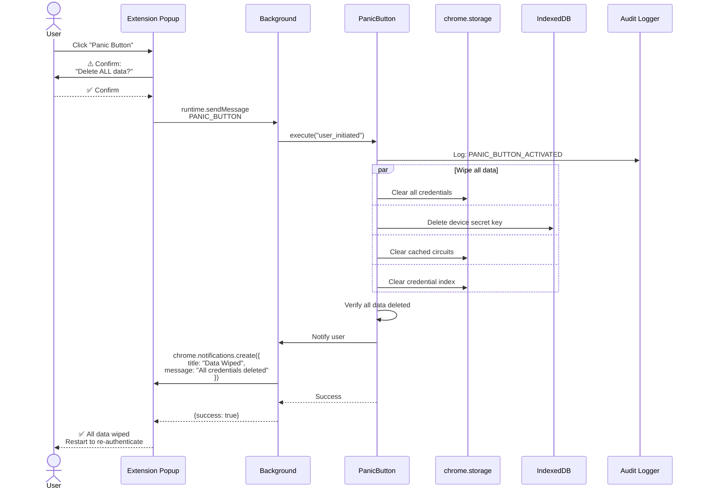
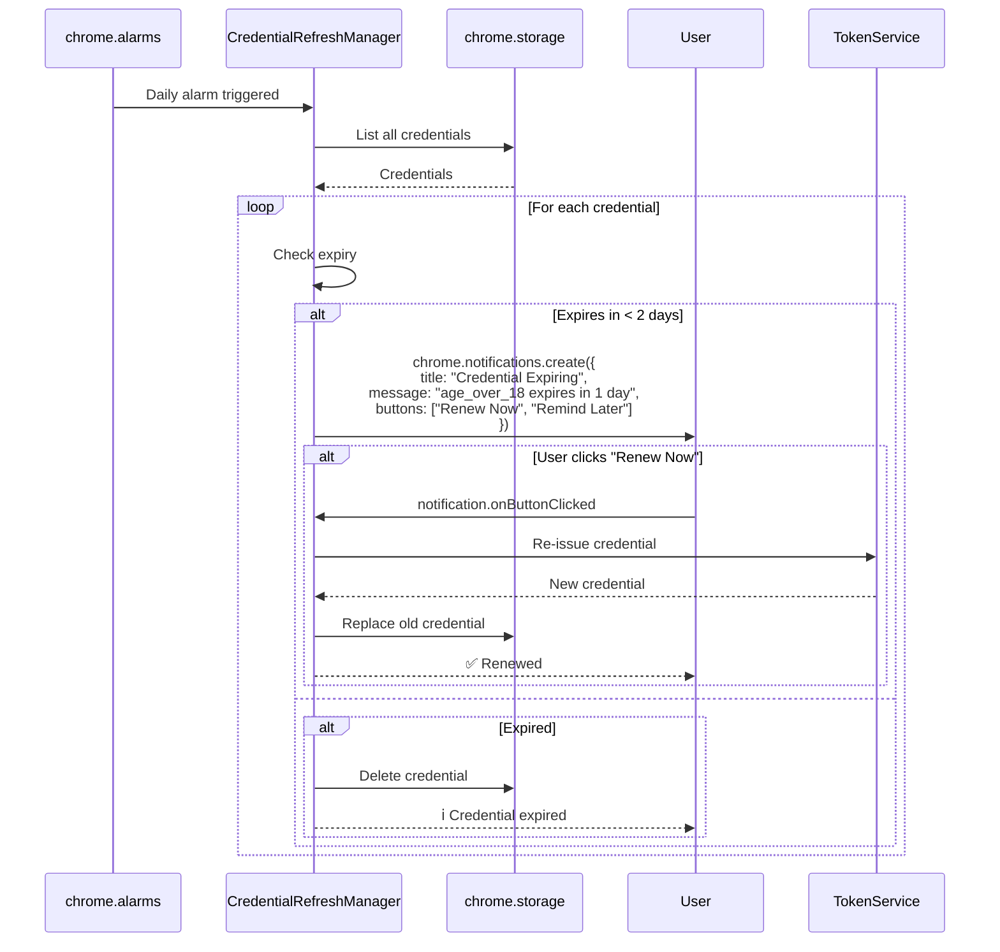
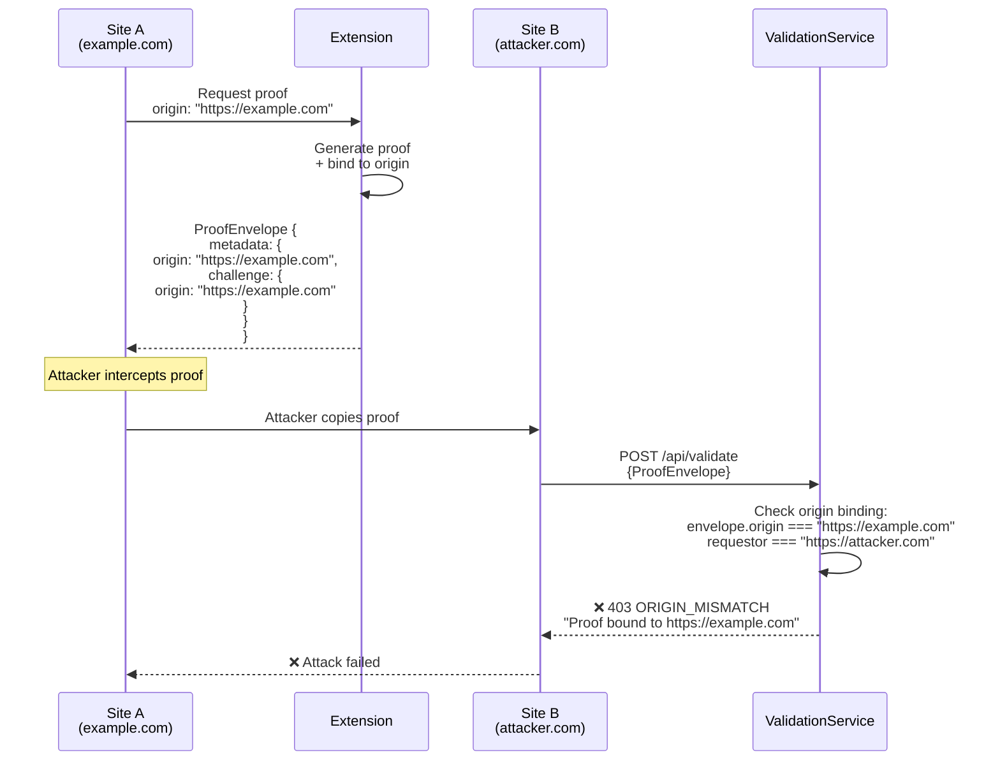
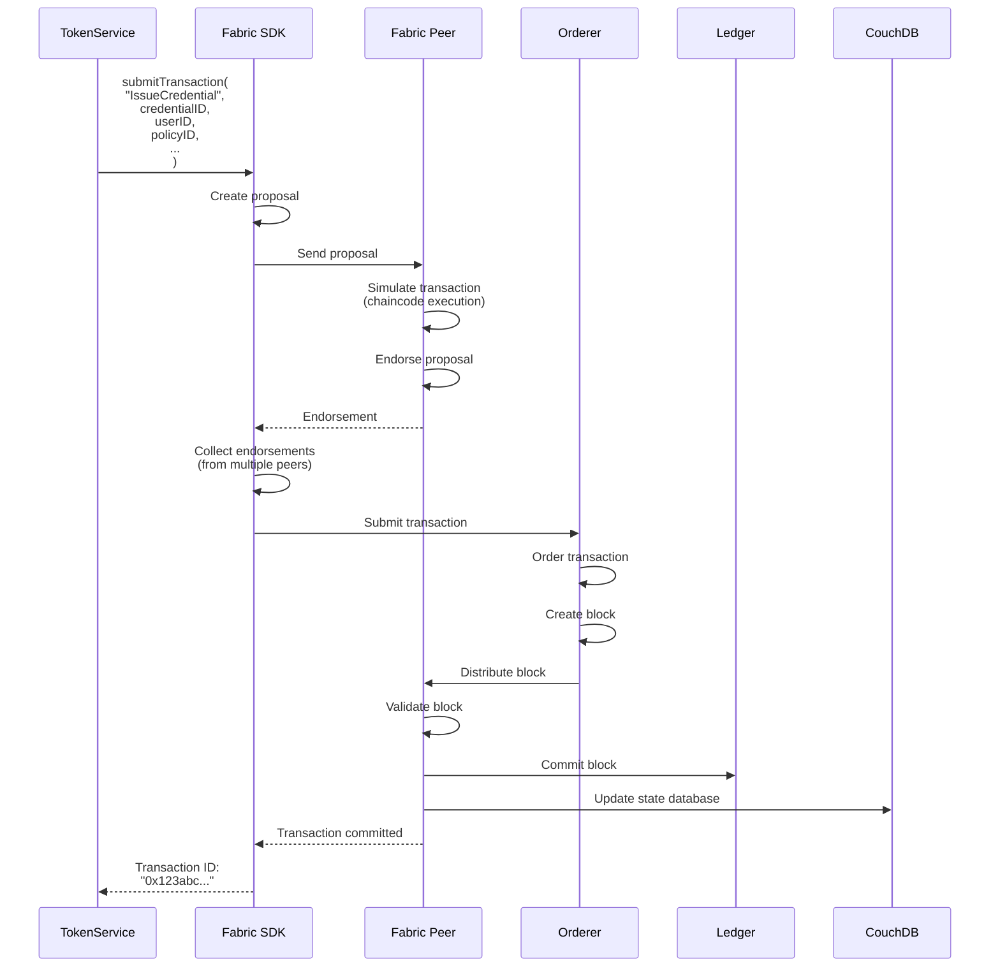

# Data Flow Documentation

## Overview

This document details all major data flows in the ZKP Credential Platform using sequence diagrams and explanations.

---

## 1. Credential Issuance Flow

Complete flow from user authentication to encrypted credential storage.

**Duration:** ~5-8 seconds

**Key Points:**
1. MitID authentication (OAuth 2.0)
2. Policy-based credential issuance
3. Blockchain recording (immutable)
4. Device-bound encryption

---

## 2. Proof Generation Flow

Zero-knowledge proof generation on user device.

**Duration:** ~2-3 seconds (age verification)

**Security Highlights:**
- User consent required
- Origin validation (double-check)
- Circuit integrity verification
- Device-bound signing

---

## 3. Proof Validation Flow

Backend validation of zero-knowledge proof.

**Duration:** ~100-150ms

**Validation Steps:**
1. ✅ Anti-downgrade protection
2. ✅ Origin binding
3. ✅ Replay prevention (nonce)
4. ✅ Clock skew tolerance
5. ✅ ZK proof verification

---

## 4. MitID Authentication Flow

OAuth 2.0 + PKCE flow with MitID.

**Security Features:**
- PKCE (prevents authorization code interception)
- State parameter (CSRF protection)
- ID token validation (signature, claims)

---

## 5. Device Binding Flow

Credential encryption with device-specific key.

**Security:**
- Non-extractable key (cannot leave browser)
- Device tag prevents credential theft
- AES-256-GCM (authenticated encryption)

---

## 6. Panic Button Flow

Emergency data wipe.

**Duration:** < 1 second

**Wipes:**
- ✅ All credentials
- ✅ Device secret
- ✅ Cached circuits
- ✅ Credential index

**Preserves:**
- ✅ Audit log (for compliance)

---

## 7. Credential Refresh Flow

Automatic expiry monitoring and renewal.

**Schedule:** Daily at 9:00 AM (user timezone)

**Notifications:**
- 2 days before expiry
- 1 day before expiry
- On expiry (deletion)

---

## 8. Cross-Domain Replay Prevention

How origin binding prevents replay attacks.

**Security:**
- Proof is bound to specific origin
- ValidationService checks origin
- Cross-domain replay impossible

---

## 9. Fabric Transaction Flow

Writing credential to blockchain.

**Endorsement Policy:** Requires majority of org endorsements

**Confirmation Time:** ~2-3 seconds

---

## Performance Summary

| Flow | Duration | Bottleneck |
|------|----------|------------|
| Credential Issuance | 5-8s | MitID authentication |
| Proof Generation | 2-3s | ZKP computation (client) |
| Proof Validation | 100-150ms | ZK verification |
| MitID Auth | 3-5s | User interaction |
| Device Binding | < 100ms | Encryption |
| Panic Button | < 1s | Storage operations |
| Fabric Transaction | 2-3s | Consensus |

---

## Support

- **Data Flow Docs:** https://docs.zkp-wallet.dev/architecture/data-flows
- **Sequence Diagrams:** https://github.com/zkp-wallet/docs/tree/main/diagrams
- **Email:** architecture@zkp-wallet.dev
