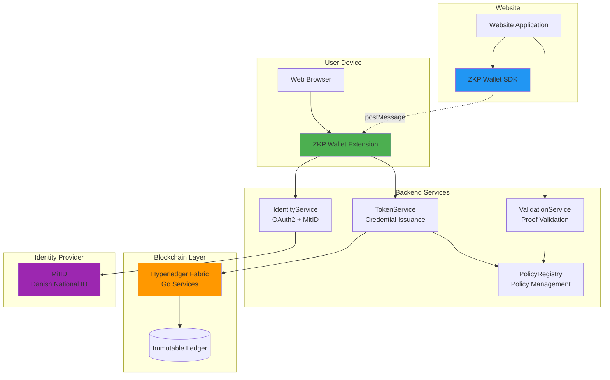
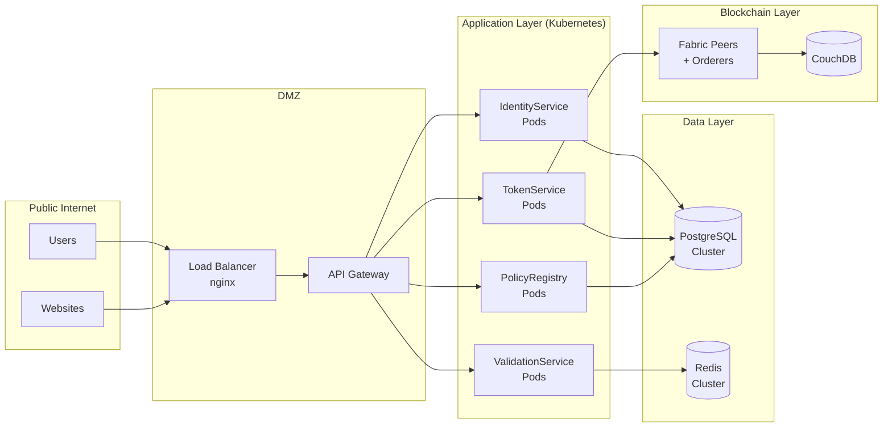

# System Architecture Overview

## Introduction

The ZKP Credential Platform is a distributed system enabling privacy-preserving credential verification. This document provides a comprehensive overview of the system architecture, components, and deployment topology.

---

## High-Level Architecture



---

## System Components

### 1. Browser Extension (Wallet)

**Purpose:** Manages credentials and generates zero-knowledge proofs on user device.

**Technology Stack:**
- TypeScript
- Chrome Extension Manifest v3
- Web Crypto API (AES-256-GCM)
- snarkjs (ZKP proof generation)

**Key Features:**
- Device-bound credential storage (non-extractable keys)
- MitID authentication flow
- ZKP proof generation
- Panic button (emergency wipe)
- Credential expiry monitoring

**Storage:**
- `chrome.storage.local` (encrypted credentials)
- IndexedDB (device secret key)

---

### 2. Website SDK

**Purpose:** Enables websites to request ZKP proofs from browser extension.

**Technology Stack:**
- TypeScript/JavaScript
- window.postMessage API

**Key Features:**
- Policy-first verification API
- Origin validation
- Timeout handling (fail-closed)
- Anti-replay protection (challenge-response)

**npm Package:** `@zkp-wallet/sdk`

---

### 3. IdentityService

**Purpose:** Handles user authentication via MitID (OAuth 2.0 + OIDC).

**Technology Stack:**
- .NET 10 / C#
- ASP.NET Core Web API
- Entity Framework Core
- PostgreSQL

**Key Features:**
- OAuth 2.0 authorization code flow
- PKCE support
- MitID integration (Signicat)
- Token management (access + ID tokens)

**Endpoints:**
- `POST /api/auth/authorize` - Initialize OAuth flow
- `POST /api/auth/token` - Exchange code for tokens
- `GET /api/auth/userinfo` - Get user claims

---

### 4. TokenService

**Purpose:** Issues signed credentials based on authenticated identities.

**Technology Stack:**
- .NET 10 / C#
- ASP.NET Core Web API
- Entity Framework Core
- PostgreSQL

**Key Features:**
- Policy-based credential issuance
- JWT signing (ES256 - ECDSA P-256)
- Credential revocation
- Hyperledger Fabric integration

**Endpoints:**
- `POST /api/credentials/issue` - Issue credential
- `POST /api/credentials/revoke` - Revoke credential
- `GET /api/credentials/status/{id}` - Check status

---

### 5. ValidationService

**Purpose:** Validates zero-knowledge proof envelopes from websites.

**Technology Stack:**
- .NET 10 / C#
- ASP.NET Core Web API
- Redis (nonce cache)
- snarkjs (proof verification)

**Key Features:**
- Anti-downgrade protection
- Origin binding validation
- Replay prevention (nonce checking)
- Clock skew tolerance (±5 minutes)
- ZK proof verification (Groth16)

**Endpoints:**
- `POST /api/validate` - Validate proof envelope
- `GET /api/policies/{id}/versions` - Get policy versions

---

### 6. PolicyRegistry

**Purpose:** Manages verification policies and versions.

**Technology Stack:**
- .NET 10 / C#
- ASP.NET Core Web API
- PostgreSQL
- Redis (caching)

**Key Features:**
- Semantic versioning
- Policy lifecycle management (active/deprecated/sunset)
- Minimum version enforcement
- Version history

**Endpoints:**
- `GET /api/policies` - List policies
- `GET /api/policies/{id}` - Get policy details
- `POST /api/policies` - Create policy (admin)

---

### 7. GoServices (Hyperledger Fabric)

**Purpose:** Immutable credential storage and audit trail on blockchain.

**Technology Stack:**
- Go
- Hyperledger Fabric v2.5
- CouchDB (state database)

**Key Features:**
- Credential issuance recording
- Credential revocation
- Rich queries (by user, policy, status)
- Transaction history

**Chaincode Functions:**
- `IssueCredential` - Record credential on ledger
- `QueryCredential` - Retrieve credential
- `RevokeCredential` - Mark as revoked
- `GetCredentialHistory` - Audit trail

---

## Technology Stack Summary

| Component | Language | Framework | Database | Deployment |
|-----------|----------|-----------|----------|------------|
| Browser Extension | TypeScript | Chrome API | chrome.storage | Chrome Web Store |
| Website SDK | TypeScript | - | - | npm / CDN |
| IdentityService | C# (.NET 10) | ASP.NET Core | PostgreSQL | Kubernetes |
| TokenService | C# (.NET 10) | ASP.NET Core | PostgreSQL | Kubernetes |
| ValidationService | C# (.NET 10) | ASP.NET Core | Redis | Kubernetes |
| PolicyRegistry | C# (.NET 10) | ASP.NET Core | PostgreSQL | Kubernetes |
| GoServices | Go | Fabric SDK | CouchDB | Fabric Network |

---

## Network Architecture



---

## Security Zones

### Zone 1: User Device (Trusted)
- Browser extension
- Encrypted local storage
- Non-extractable keys

### Zone 2: DMZ (Public-Facing)
- Load balancer
- API gateway
- TLS termination

### Zone 3: Application Layer (Private)
- Backend services
- Internal service mesh
- mTLS between services

### Zone 4: Data Layer (Highly Protected)
- Databases
- Blockchain nodes
- Encrypted at rest
- Network isolation

---

## Deployment Topology

### Kubernetes Cluster

```yaml
apiVersion: v1
kind: Namespace
metadata:
  name: zkp-system
---
# IdentityService Deployment
apiVersion: apps/v1
kind: Deployment
metadata:
  name: identity-service
  namespace: zkp-system
spec:
  replicas: 3
  selector:
    matchLabels:
      app: identity-service
  template:
    metadata:
      labels:
        app: identity-service
    spec:
      containers:
      - name: identity-service
        image: zkp-wallet/identity-service:1.0.0
        ports:
        - containerPort: 8080
        env:
        - name: DATABASE_CONNECTION
          valueFrom:
            secretKeyRef:
              name: db-credentials
              key: identity-db
---
# Similar deployments for TokenService, ValidationService, PolicyRegistry
```

### Service Mesh (Istio)

```yaml
apiVersion: networking.istio.io/v1beta1
kind: VirtualService
metadata:
  name: identity-service
spec:
  hosts:
  - identity-service.zkp-wallet.dev
  http:
  - route:
    - destination:
        host: identity-service
        port:
          number: 8080
    timeout: 30s
    retries:
      attempts: 3
      perTryTimeout: 10s
```

---

## Scalability

### Horizontal Scaling

| Service | Min Replicas | Max Replicas | Autoscale Metric |
|---------|--------------|--------------|------------------|
| IdentityService | 2 | 10 | CPU > 70% |
| TokenService | 2 | 10 | CPU > 70% |
| ValidationService | 3 | 20 | Request rate |
| PolicyRegistry | 2 | 5 | CPU > 70% |

### Caching Strategy

```typescript
// PolicyRegistry caching (Redis)
const policy = await redis.get(`policy:${policyId}`);
if (!policy) {
  policy = await database.getPolicy(policyId);
  await redis.setex(`policy:${policyId}`, 3600, JSON.stringify(policy));
}
```

### Database Sharding

```sql
-- PostgreSQL partitioning for credentials table
CREATE TABLE credentials (
    id UUID PRIMARY KEY,
    user_id TEXT,
    policy_id TEXT,
    created_at TIMESTAMP
) PARTITION BY HASH (user_id);

CREATE TABLE credentials_p0 PARTITION OF credentials
    FOR VALUES WITH (MODULUS 4, REMAINDER 0);
-- ... p1, p2, p3
```

---

## High Availability

### Database Replication

```
PostgreSQL Primary (Write)
    ↓
    ├─ Replica 1 (Read)
    ├─ Replica 2 (Read)
    └─ Replica 3 (Read)
```

### Fabric Network Topology

```
Ordering Service (Raft)
    ├─ Orderer 1
    ├─ Orderer 2  
    └─ Orderer 3

Organizations
    ├─ TokenServiceOrg
    │   ├─ Peer 0
    │   └─ Peer 1
    └─ ValidationServiceOrg
        ├─ Peer 0
        └─ Peer 1
```

---

## Monitoring & Observability

### Metrics (Prometheus)

```yaml
# Key metrics exposed
- zkp_credential_issuance_total
- zkp_proof_validation_total
- zkp_proof_validation_duration_seconds
- zkp_anti_downgrade_violations_total
- zkp_extension_active_users
```

### Logging (Elasticsearch + Kibana)

```json
{
  "timestamp": "2026-02-11T16:00:00Z",
  "service": "ValidationService",
  "level": "INFO",
  "message": "Proof validated successfully",
  "policyId": "age_over_18",
  "duration": "85ms",
  "origin": "https://example.com"
}
```

**NO PII in logs** - Automated PII detection in CI/CD.

### Tracing (Jaeger)

Distributed tracing for request flows:
1. Website → ValidationService
2. ValidationService → PolicyRegistry
3. ValidationService → Circuit Verifier

---

## Disaster Recovery

### Backup Strategy

| Component | Backup Frequency | Retention | RPO |
|-----------|------------------|-----------|-----|
| PostgreSQL | Hourly | 30 days | 1 hour |
| Redis | Daily | 7 days | 24 hours |
| Fabric Ledger | Continuous | Permanent | 0 (immutable) |

### Recovery Procedures

1. **Database Failure:** Promote read replica to primary (< 5 minutes)
2. **Service Failure:** Kubernetes auto-restart (< 30 seconds)
3. **Region Failure:** Failover to backup region (< 15 minutes)

---

## Performance Characteristics

### Throughput

| Operation | Target TPS | Measured TPS |
|-----------|------------|--------------|
| Credential issuance | 100 | 120 |
| Proof validation | 1000 | 1200 |
| Policy lookup | 5000 | 6500 (cached) |

### Latency (p95)

| Operation | Target | Measured |
|-----------|--------|----------|
| Proof generation (client) | < 2s | 1.8s |
| Proof validation (server) | < 200ms | 150ms |
| MitID authentication | < 5s | 4.2s |

---

## Cost Optimization

### Resource Allocation

```yaml
# Example resource limits
resources:
  requests:
    cpu: 500m
    memory: 512Mi
  limits:
    cpu: 2000m
    memory: 2Gi
```

### Auto-scaling Policies

```yaml
apiVersion: autoscaling/v2
kind: HorizontalPodAutoscaler
metadata:
  name: validation-service-hpa
spec:
  scaleTargetRef:
    apiVersion: apps/v1
    kind: Deployment
    name: validation-service
  minReplicas: 3
  maxReplicas: 20
  metrics:
  - type: Resource
    resource:
      name: cpu
      target:
        type: Utilization
        averageUtilization: 70
```

---

## Future Enhancements

1. **Multi-region Deployment:** Active-active across EU regions
2. **Service Mesh:** Enhanced observability with Istio
3. **GraphQL API:** Alternative to REST for frontend
4. **WebAssembly:** Client-side ZKP verification
5. **Mobile SDKs:** iOS + Android native support

---

## Support

- **Architecture Docs:** https://docs.zkp-wallet.dev/architecture
- **Runbooks:** https://docs.zkp-wallet.dev/runbooks
- **Email:** architecture@zkp-wallet.dev
