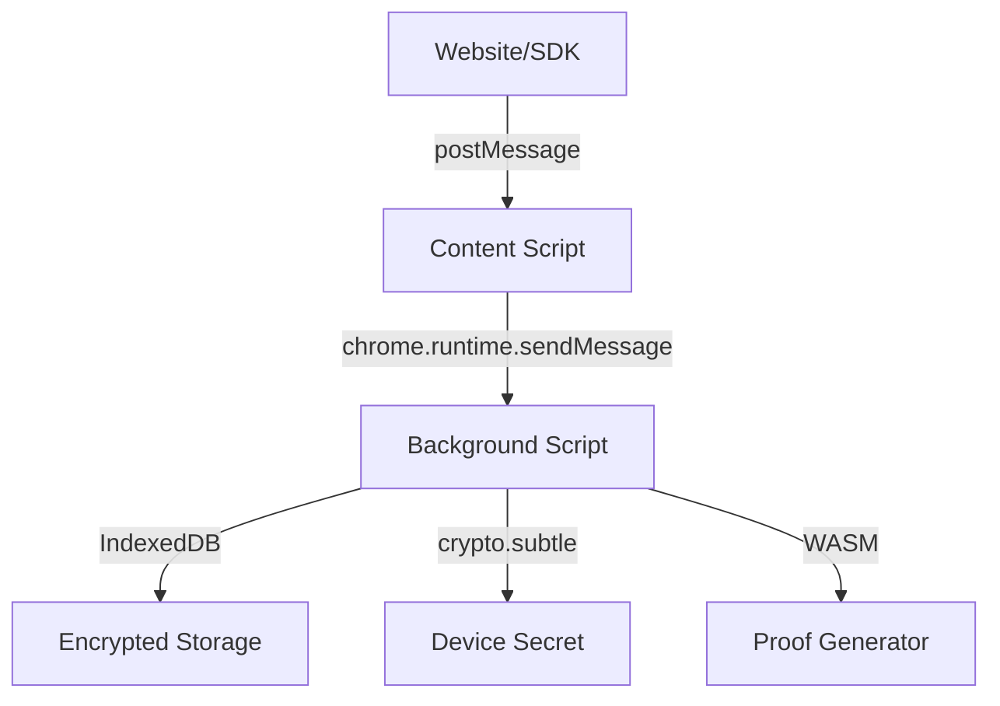

# Browser Extension Security Architecture

**Version:** 1.0  
**Last Updated:** 2026-02-11  
**Status:** Active

---

## 1. Overview

This document specifies the security architecture for the ZKP Credential Platform browser extension. The extension is the **most critical attack surface** and requires defense-in-depth.

**Security Goals:**
- ✅ Secrets never accessible to content scripts (strict isolation)
- ✅ Device binding (credentials tied to specific device)
- ✅ Panic button (instant credential wipe on compromise)
- ✅ Minimal API surface (reduce attack vectors)
- ✅ Auditable code (no obfuscation, clear data flow)

---

## 2. Threat Model

### 2.1 Attack Scenarios

**Scenario 1: Malicious Website**
- Website attempts to read secrets from extension
- Defense: Content script isolation (no secret access)

**Scenario 2: Compromised Content Script**
- XSS in website compromises content script
- Defense: Content script cannot access secrets (background script only)

**Scenario 3: Device Theft**
- Attacker steals user's device
- Defense: Device binding + panic button + credential expiry

**Scenario 4: Extension Compromise**
- Attacker publishes malicious extension update
- Defense: Code signing, update verification, user transparency

---

## 3. Architecture

### 3.1 Component Separation



**Key Principles:**
- Content script: **NO ACCESS** to secrets
- Background script: **ONLY** component with secret access
- Storage: **ALWAYS** encrypted (AES-256-GCM)

---

### 3.2 Data Flow

**Proof Generation Flow:**

```
1. Website → SDK: EWallet.verifyPolicy("age_over_18")
2. SDK → Content Script: EWALLET_VERIFY_REQUEST
3. Content Script → Background: chrome.runtime.sendMessage({ type: "GENERATE_PROOF", ... })
4. Background → User: Show consent popup
5. User approves
6. Background: 
   - Decrypt credential (device secret as key)
   - Load circuit WASM
   - Generate proof
   - Sign envelope (extension signing key)
7. Background → Content Script: { type: "PROOF_READY", envelope }
8. Content Script → SDK: postMessage({ type: "EWALLET_VERIFY_RESPONSE", ... })
9. SDK → Website: { success: true, proof }
```

**CRITICAL:** Credential never crosses background→content boundary

---

## 4. Device Secret Management

### 4.1 Secret Generation

**On first install:**

```typescript
async function generateDeviceSecret(): Promise<CryptoKey> {
  // Generate 256-bit symmetric key
  const key = await crypto.subtle.generateKey(
    {
      name: "AES-GCM",
      length: 256
    },
    false, // NOT extractable (cannot export)
    ["encrypt", "decrypt"]
  );
  
  // Store in IndexedDB (non-extractable stays in memory)
  // Bound to browser profile
  return key;
}
```

**Properties:**
- Non-extractable (cannot be exported)
- Bound to browser profile
- Regenerated if lost (credentials wiped)

---

### 4.2 Device Binding

**Credential Encryption:**

```typescript
async function encryptCredential(
  credential: PolicyCredential,
  deviceSecret: CryptoKey
): Promise<EncryptedCredential> {
  
  const iv = crypto.getRandomValues(new Uint8Array(12)); // 96-bit nonce
  const credentialBytes = new TextEncoder().encode(JSON.stringify(credential));
  
  const ciphertext = await crypto.subtle.encrypt(
    {
      name: "AES-GCM",
      iv: iv
    },
    deviceSecret,
    credentialBytes
  );
  
  return {
    ciphertext: arrayBufferToBase64(ciphertext),
    iv: arrayBufferToBase64(iv),
    deviceTag: await computeDeviceTag(deviceSecret) // For proof binding
  };
}
```

**Device Tag:**
- SHA256(publicKeyDER of device secret)
- Included in credential at issuance
- Included in proof public signals
- Validator checks: proof.deviceTag === credential.deviceTag

---

### 4.3 Panic Button

**User-initiated credential wipe:**

```typescript
async function wipeAllCredentials(): Promise<void> {
  // 1. Delete all credentials from IndexedDB
  await credentialStore.clear();
  
  // 2. Delete device secret (force regeneration)
  await keyStore.delete("device_secret");
  
  // 3. Clear all cached circuits
  await circuitStore.clear();
  
  // 4. Invalidate session tokens
  await sessionStore.clear();
  
  // 5. Log wipe event (no PII)
  logger.critical("PANIC_BUTTON_ACTIVATED", {
    timestamp: Date.now(),
    credentialCount: credentialCount,
    trigger: "user_initiated"
  });
  
  // 6. Show confirmation to user
  await showNotification("All credentials wiped. Extension reset.");
}
```

**Triggers:**
- User clicks "Wipe All Credentials" in extension settings
- Device reported stolen (future: remote wipe API)
- Suspicious activity detected (future enhancement)

**RTO:** Instant (< 1 second)

---

## 5. Content Script Isolation

### 5.1 Security Boundaries

**Content Script CAN:**
- Receive proof envelopes (already signed)
- Forward messages between SDK ↔ Background
- Read active tab origin

**Content Script CANNOT:**
- Access credentials
- Access device secret
- Generate proofs
- Decrypt stored data
- Access crypto keys

**Enforcement:** Architecture (no code path exists)

---

### 5.2 Message Protocol

**Content Script → Background:**

```typescript
// Content script (content.ts)
chrome.runtime.sendMessage({
  type: "GENERATE_PROOF",
  requestId: "uuid-v4",
  policyId: "age_over_18",
  challenge: { ... },
  origin: window.location.origin
});
```

**Background → Content Script:**

```typescript
// Background (background.ts)
chrome.tabs.sendMessage(tabId, {
  type: "PROOF_READY",
  requestId: "uuid-v4",
  envelope: { ... },  // Already signed, no secrets
  signature: "..."
});
```

**CRITICAL:** Only signed envelopes cross boundary

---

## 6. Storage Security

### 6.1 Encrypted Storage

**All credentials encrypted at rest:**

```typescript
interface EncryptedCredential {
  id: string;                    // Credential ID (cleartext for indexing)
  policyId: string;              // Policy ID (cleartext for lookup)
  ciphertext: string;            // Base64 encrypted credential
  iv: string;                    // Base64 initialization vector
  deviceTag: string;             // Device binding tag
  encryptedAt: number;           // Unix timestamp
}
```

**IndexedDB Schema:**

```typescript
const dbSchema = {
  name: "ewallet_secure_storage",
  version: 1,
  stores: [
    {
      name: "credentials",
      keyPath: "id",
      indexes: [
        { name: "policyId", keyPath: "policyId" },
        { name: "deviceTag", keyPath: "deviceTag" }
      ]
    },
    {
      name: "deviceKeys",
      keyPath: "keyId"
    }
  ]
};
```

---

### 6.2 Storage Quotas

**Limits:**
- Max 100 credentials per user
- Max 10 MB total storage
- Auto-cleanup: Delete expired credentials daily

**Rationale:** Prevent storage exhaustion attacks

---

## 7. Circuit Loading Security

### 7.1 Circuit Integrity

**Before loading circuit:**

```typescript
async function loadCircuit(circuitId: string, version: string): Promise<Circuit> {
  // 1. Check minimum version (downgrade protection)
  if (!satisfiesMinimum(circuitId, version)) {
    throw new Error(`Circuit ${circuitId}@${version} below minimum`);
  }
  
  // 2. Fetch manifest
  const manifest = await fetch(`/circuits/${circuitId}/${version}/manifest.json`);
  
  // 3. Verify manifest signature
  const isValid = await verifyManifestSignature(manifest);
  if (!isValid) {
    throw new Error("Circuit manifest signature invalid");
  }
  
  // 4. Fetch WASM
  const wasmBytes = await fetch(`/circuits/${circuitId}/${version}/prover.wasm`);
  
  // 5. Verify WASM hash
  const actualHash = await sha256(wasmBytes);
  if (actualHash !== manifest.artifacts.prover.sha256) {
    throw new Error("Circuit WASM hash mismatch - TAMPERED");
  }
  
  // 6. Load WASM
  const module = await WebAssembly.compile(wasmBytes);
  
  return { module, manifest };
}
```

**All checks mandatory** (fail-closed)

---

## 8. User Consent & Transparency

### 8.1 Consent Popup

**Before generating proof, show:**

```
┌─────────────────────────────────────────┐
│ 🔐 Proof Request                        │
├─────────────────────────────────────────┤
│ Website: https://gambling.com           │
│ Policy: Age Over 18                     │
│                                          │
│ This website requests proof that you    │
│ are over 18 years old.                  │
│                                          │
│ Information revealed:                   │
│ ✓ You are over 18                       │
│ ✗ Your exact age (hidden)               │
│ ✗ Your name (hidden)                    │
│                                          │
│ ┌─────────────┐  ┌──────────────────┐   │
│ │   Deny      │  │   Allow          │   │
│ └─────────────┘  └──────────────────┘   │
└─────────────────────────────────────────┘
```

**Mandatory elements:**
- Origin (domain)
- Policy description
- What is revealed vs. hidden
- User must click "Allow" (no default approval)

---

### 8.2 Audit Log

**All proof generations logged:**

```typescript
interface ProofAuditEntry {
  timestamp: number;           // Unix timestamp
  requestId: string;           // Unique request ID
  origin: string;              // Requesting website
  policyId: string;            // Policy verified
  userConsent: boolean;        // true = allowed, false = denied
  proofGenerated: boolean;     // Success/failure
  errorCode?: string;          // If failed
}
```

**Storage:** Max 1000 entries, FIFO eviction

**Purpose:** User transparency, forensics

---

## 9. Update Security

### 9.1 Extension Updates

**Update verification:**

```typescript
// manifest.json
{
  "update_url": "https://clients2.google.com/service/update2/crx",
  "version": "1.2.0",
  "minimum_chrome_version": "120"
}
```

**Chrome Web Store enforces:**
- Code signing (developer signature)
- Review process (human審査)
- Two-step verification for publisher account

**User notification:**
- Extension updates prompt user consent
- Changelog displayed (transparent changes)

---

### 9.2 Circuit Updates

**Automatic background updates:**

```typescript
// Daily circuit update check
async function checkCircuitUpdates(): Promise<void> {
  for (const circuitId of installedCircuits) {
    const latestVersion = await fetchLatestVersion(circuitId);
    const currentVersion = getInstalledVersion(circuitId);
    
    if (semver.gt(latestVersion, currentVersion)) {
      // Download and verify new circuit
      await downloadAndVerifyCircuit(circuitId, latestVersion);
      
      // Notify user (non-intrusive)
      logger.info("Circuit updated", { circuitId, latestVersion });
    }
  }
}
```

**User control:** Settings to disable auto-updates

---

## 10. Operational Playbook

### 10.1 Scenario: Device Stolen

**User reports device stolen:**

1. User accesses EWallet from another device
2. User logs in and navigates to "Devices"
3. User selects compromised device
4. User clicks "Wipe Credentials on This Device"
5. **Remote wipe API** (future enhancement):
   - Extension polls server every 5 minutes
   - Server responds with `{ wipe: true }`
   - Extension executes panic button
   - Credentials wiped, device secret deleted

**Current MVP:** Manual wipe only (future: remote API)

---

### 10.2 Scenario: Extension Compromise

**Malicious update published:**

1. **Detection:** Security team notified by user reports
2. **Action:** Contact Chrome Web Store for takedown
3. **Mitigation:** Publish patched version immediately
4. **User communication:** In-app banner warning users
5. **Credential rotation:** Advise users to re-authenticate

**RTO:** < 4 hours (from detection to patched version live)

---

## 11. Testing Strategy

### 11.1 Unit Tests

**DeviceSecretManager:**
- Secret generation (non-extractable)
- Encryption/decryption (AES-GCM)
- Device tag computation

**PanicButton:**
- Wipe all credentials
- Delete device secret
- Audit log entry

---

### 11.2 Integration Tests

**Content Script Isolation:**
- Verify content script cannot access secrets
- Test message boundaries (only envelopes cross)

**Circuit Loading:**
- Tampered WASM → Reject
- Unsigned manifest → Reject
- Downgrade attempt → Reject

---

### 11.3 Security Tests

**Attack Simulations:**
- XSS in website → Content script isolated ✅
- Man-in-the-middle circuit delivery → Signature check fails ✅
- Storage extraction → Credentials encrypted ✅
- Device theft → Panic button wipes all ✅

---

## 12. Code Review Checklist

**Before merging extension code:**

- [ ] No secrets in content script (grep for `crypto`, `credential`)
- [ ] All storage encrypted (no cleartext credentials)
- [ ] Device secret non-extractable
- [ ] Panic button tested (credentials wiped)
- [ ] Circuit signature verified before load
- [ ] User consent required (no silent proof generation)
- [ ] Audit log functional
- [ ] No eval() or dangerous APIs

---

## 13. Future Enhancements

**Phase 2:**
- Remote wipe API (cloud-initiated panic button)
- Multi-device sync (encrypted)
- Biometric unlock (WebAuthn)
- Hardware wallet integration (Ledger)

---

## References

- [Threat Model](file:///e:/Ny%20mappe%20%282%29/EWalletSystem/docs/threat-model.md)
- [Security Invariants](file:///e:/Ny%20mappe%20%282%29/EWalletSystem/docs/security-invariants.md)
- [Protocol Specification](file:///e:/Ny%20mappe%20%282%29/EWalletSystem/docs/protocol.md)

---

**Approval Status:** Ready for implementation  
**Reviewed By:** Security team  
**Version:** 1.0 (2026-02-11)
