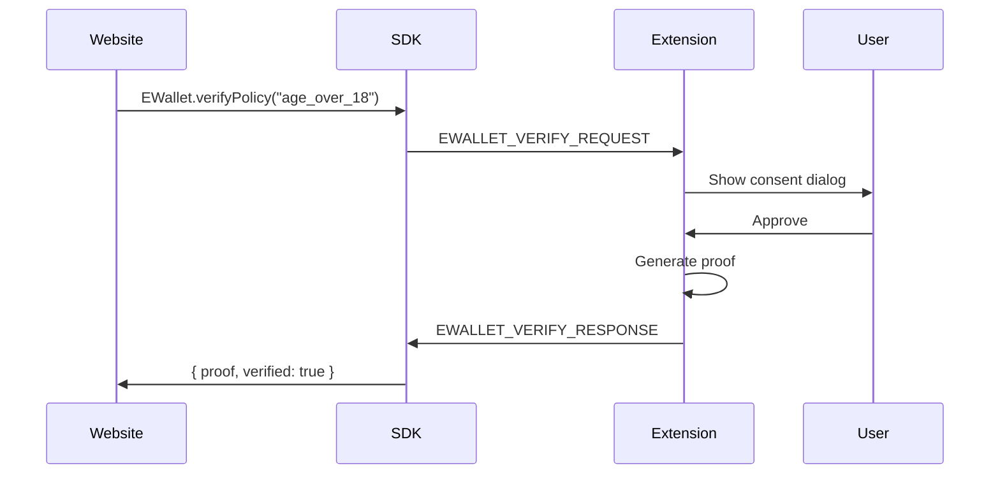

# Protocol Specification — ZKP Credential Platform

**Version:** 1.0  
**Last Updated:** 2026-02-11  
**Status:** Draft

---

## 1. Overview

This document specifies the message formats and protocols for the ZKP Credential Platform. All implementations MUST conform to this specification.

**Versioning:** Protocol uses semantic versioning independent of circuit versions.

---

## 2. Proof Envelope v1

### 2.1 Structure

The proof envelope is a JSON object containing all data required for verification.

```json
{
  "protocolVersion": "1.0.0",
  "policyId": "age_over_18",
  "policyVersion": "1.2.0",
  "origin": "https://gambling.com",
  "nonce": "a3f8b2c1...",
  "issuedAt": 1707659400,
  "proof": { ... },
  "publicSignals": [ ... ],
  "credentialHash": "sha256:abc123...",
  "policyHash": "sha256:def456...",
  "signature": "..."
}
```

### 2.2 Field Definitions

| Field | Type | Required | Description |
|-------|------|----------|-------------|
| `protocolVersion` | string | ✅ | Semantic version of protocol (e.g. "1.0.0") |
| `policyId` | string | ✅ | Policy identifier (e.g. "age_over_18") |
| `policyVersion` | string | ✅ | Policy semantic version (e.g. "1.2.0") |
| `origin` | string | ✅ | Origin of requesting website (e.g. "https://example.com") |
| `nonce` | string | ✅ | Website-generated nonce (hex, min 32 bytes) |
| `issuedAt` | integer | ✅ | Unix timestamp when proof generated |
| `proof` | object | ✅ | zk-SNARK proof object (Groth16 format) |
| `publicSignals` | array | ✅ | Public inputs to circuit |
| `credentialHash` | string | ✅ | SHA256 hash of credential (format: "sha256:...") |
| `policyHash` | string | ✅ | SHA256 hash of policy definition |
| `signature` | string | ✅ | Extension signature over canonical envelope |

### 2.3 Canonical JSON Encoding

For signature verification, the envelope MUST be canonicalized:

**Rules:**
1. Remove `signature` field
2. Sort object keys alphabetically (recursive)
3. No whitespace (compact JSON)
4. UTF-8 encoding

**Example:**
```javascript
// Before canonicalization
{
  "nonce": "abc",
  "origin": "https://example.com",
  "proof": { "pi_b": [...], "pi_a": [...] }
}

// After canonicalization
{"nonce":"abc","origin":"https://example.com","proof":{"pi_a":[...],"pi_b":[...]}}
```

### 2.4 Signature Algorithm

**Algorithm:** ECDSA with P-256 curve  
**Hash:** SHA-256  
**Format:** Base64-encoded DER signature

```javascript
const canonical = canonicalizeEnvelope(envelope);
const hash = sha256(canonical);
const signature = ecdsa.sign(hash, extensionPrivateKey);
envelope.signature = base64(signature);
```

---

## 3. Challenge Format

Websites request proofs via a challenge object.

### 3.1 Challenge Structure

```json
{
  "policyId": "age_over_18",
  "policyVersion": "^1.2.0",
  "nonce": "a3f8b2c1e5...",
  "timestamp": 1707659400,
  "domain": "gambling.com"
}
```

### 3.2 Field Definitions

| Field | Type | Required | Description |
|-------|------|----------|-------------|
| `policyId` | string | ✅ | Policy to verify |
| `policyVersion` | string | ✅ | Semver range (e.g. "^1.2.0", "1.x") |
| `nonce` | string | ✅ | Random nonce (hex, min 32 bytes entropy) |
| `timestamp` | integer | ✅ | Unix timestamp when challenge created |
| `domain` | string | ✅ | Expected origin (matches `window.location.origin`) |

### 3.3 Challenge Binding

The challenge is hashed and included in proof public inputs:

```javascript
const challengeHash = poseidon([
  hash(policyId),
  hash(policyVersion),
  hash(nonce),
  hash(domain),
  timestamp
]);
// challengeHash included in circuit public inputs
```

---

## 4. Message Protocol (Extension ↔ Website)

### 4.1 Request Flow



### 4.2 Request Message

```javascript
{
  "type": "EWALLET_VERIFY_REQUEST",
  "requestId": "uuid-v4",
  "policyId": "age_over_18",
  "policyVersion": "^1.0.0",
  "challenge": { ... },
  "timestamp": 1707659400
}
```

### 4.3 Response Message

```javascript
{
  "type": "EWALLET_VERIFY_RESPONSE",
  "requestId": "uuid-v4",
  "success": true,
  "proofEnvelope": { ... },
  "signature": "...",
  "timestamp": 1707659405
}
```

### 4.4 Error Response

```javascript
{
  "type": "EWALLET_VERIFY_ERROR",
  "requestId": "uuid-v4",
  "error": {
    "code": "USER_REJECTED",
    "message": "User denied consent"
  },
  "timestamp": 1707659403
}
```

**Error Codes:**
- `USER_REJECTED`: User denied consent in popup
- `NO_CREDENTIAL`: User doesn't have required credential
- `PROOF_GENERATION_FAILED`: Circuit execution failed
- `ORIGIN_MISMATCH`: Origin verification failed
- `TIMEOUT`: Request exceeded timeout (30s)

---

## 5. Public Signals Format

Public signals are circuit outputs included in the proof.

### 5.1 Standard Public Signals

**All policies MUST include:**

```javascript
[
  challengeHash,         // Poseidon hash of challenge
  credentialHash,        // SHA256 of credential
  policyHash,            // SHA256 of policy definition
  originHash,            // Poseidon hash of origin
  issuedAt,              // Unix timestamp
  expiresAt,             // Unix timestamp
  policyResult           // 1 = pass, 0 = fail
]
```

### 5.2 Policy-Specific Signals

Additional signals vary by policy:

**Age Over 18:**
```javascript
[
  ...standardSignals,
  currentYear,           // e.g. 2026
  minimumAge             // e.g. 18
]
```

**Licensed Doctor:**
```javascript
[
  ...standardSignals,
  licenseType,           // e.g. hash("medical_doctor")
  licenseCountry         // e.g. hash("DK")
]
```

---

## 6. Policy Definition Format

Policies are registered in the policy registry.

### 6.1 Policy Schema

```json
{
  "policyId": "age_over_18",
  "version": "1.2.0",
  "circuitId": "age_verification_v1",
  "verificationKeyId": "vkey-age-v1-2024",
  "verificationKeyFingerprint": "sha256:abc123...",
  "compatibleVersions": "^1.0.0",
  "defaultExpiry": "72h",
  "requiredPublicSignals": {
    "challengeHash": "field",
    "credentialHash": "field",
    "policyHash": "field",
    "originHash": "field",
    "issuedAt": "uint64",
    "expiresAt": "uint64",
    "policyResult": "bool"
  },
  "status": "active",
  "deprecatedAt": null,
  "signature": "..."
}
```

### 6.2 Policy Lifecycle States

| State | Description | Can be used? |
|-------|-------------|--------------|
| `active` | Current production policy | ✅ Yes |
| `deprecated` | Being phased out (grace period) | ✅ Yes (with warning) |
| `blocked` | Security issue, emergency stop | ❌ No |

### 6.3 Policy Versioning

**Semantic Versioning:**
- **Major** (1.x.x): Breaking changes (new circuit, incompatible signals)
- **Minor** (x.1.x): Backward-compatible additions
- **Patch** (x.x.1): Bug fixes, no circuit changes

**Compatibility:**
- Validator accepts `compatibleVersions` range
- Circuit version MUST match policy version
- Cross-version proofs rejected

---

## 7. Clock Skew Handling

### 7.1 Tolerance

**Maximum skew:** ±5 minutes  
**Validation:**
```javascript
const now = Date.now() / 1000;
const skew = Math.abs(now - credential.issuedAt);
if (skew > 300) {  // 5 minutes
  return { valid: false, reason: "CLOCK_SKEW_EXCEEDED" };
}
```

### 7.2 Not-Before Claim

Credentials MAY include `nbf` (not-before):
```javascript
if (credential.nbf && now < credential.nbf) {
  return { valid: false, reason: "NOT_YET_VALID" };
}
```

---

## 8. Version Negotiation

### 8.1 Protocol Version

Protocol version is negotiated separately from circuit/policy versions.

**Backward compatibility rules:**
- Minor version changes: MUST be backward compatible
- Major version changes: MAY break compatibility

**Example:**
- Validator supports: `1.0.0 - 1.x.x`
- Extension sends: `1.2.0`
- Result: ✅ Accepted

### 8.2 Policy Version Compatibility

Websites specify policy version range:

```javascript
EWallet.verifyPolicy("age_over_18", {
  version: "^1.2.0"  // Accepts 1.2.x, 1.3.x, but NOT 2.x.x
});
```

Validator checks:
1. Proof `policyVersion` in range? → Continue
2. Circuit version compatible? → Continue
3. vKey fingerprint matches? → Continue
4. Otherwise → Reject with `INCOMPATIBLE_VERSION`

---

## 9. Security Considerations

### 9.1 Origin Binding

**CRITICAL:** Origin MUST be verified at multiple layers:
1. Extension: `origin === activeTab.url.origin`
2. Proof: origin included in public inputs
3. Validator: origin matches expected domain

### 9.2 Nonce Requirements

**Minimum entropy:** 256 bits (32 bytes hex)  
**Uniqueness:** MUST be fresh per request  
**Source:** Cryptographically secure random (e.g. `crypto.getRandomValues()`)

### 9.3 Replay Prevention

**Mechanisms:**
1. Nonce binding (single-use)
2. Timestamp validation (short validity window)
3. Origin binding (domain-locked)
4. policyHash binding (policy-locked)

---

## 10. Error Handling

### 10.1 Fail Closed

All verification errors MUST result in rejection.

**Examples:**
- Missing field → REJECT
- Invalid signature → REJECT
- Exception during verification → REJECT
- Network timeout → REJECT

**Default behavior:** DENY

### 10.2 Reason Codes

Validators MUST return specific reason codes:

| Code | Description |
|------|-------------|
| `VALID` | Proof verified successfully |
| `INVALID_SIGNATURE` | Envelope signature failed |
| `ORIGIN_MISMATCH` | Origin doesn't match |
| `POLICY_MISMATCH` | PolicyId doesn't match expected |
| `EXPIRED_CREDENTIAL` | Credential past expiry |
| `RETIRED_KEY` | Credential signed with retired key |
| `CLOCK_SKEW` | Timestamp outside tolerance |
| `INCOMPATIBLE_VERSION` | Version not in accepted range |
| `INVALID_PROOF` | zk-SNARK verification failed |
| `MISSING_FIELD` | Required envelope field missing |

---

## 11. Test Vectors

### 11.1 Valid Proof Envelope

```json
{
  "protocolVersion": "1.0.0",
  "policyId": "age_over_18",
  "policyVersion": "1.2.0",
  "origin": "https://example.com",
  "nonce": "a3f8b2c1e5d7f9a1b3c5d7e9f1a3b5c7d9e1f3a5b7c9d1e3f5a7b9c1d3e5f7a9",
  "issuedAt": 1707659400,
  "proof": {
    "pi_a": ["...", "...", "1"],
    "pi_b": [["...", "..."], ["...", "..."], ["1", "0"]],
    "pi_c": ["...", "...", "1"]
  },
  "publicSignals": [
    "12345678901234567890",  // challengeHash
    "98765432109876543210",  // credentialHash
    "11111111111111111111",  // policyHash
    "22222222222222222222",  // originHash
    "1707659400",            // issuedAt
    "1707918600",            // expiresAt
    "1"                      // policyResult (pass)
  ],
  "credentialHash": "sha256:abc123def456...",
  "policyHash": "sha256:def456abc123...",
  "signature": "MEUCIQDx..."
}
```

### 11.2 Canonical Encoding Example

**Input:**
```json
{"nonce":"abc","origin":"https://example.com"}
```

**Canonical:**
```json
{"nonce":"abc","origin":"https://example.com"}
```
(Keys alphabetically sorted, no whitespace)

---

## 12. Backwards Compatibility

### 12.1 Deprecation Policy

When protocol changes:
1. New major version released (e.g. 2.0.0)
2. Old version (1.x.x) enters deprecation (90 days minimum)
3. After grace period, old version blocked

### 12.2 Migration Path

Validators SHOULD support multiple protocol versions during transition:
```javascript
if (envelope.protocolVersion.startsWith("1.")) {
  return verifyV1(envelope);
} else if (envelope.protocolVersion.startsWith("2.")) {
  return verifyV2(envelope);
} else {
  return { valid: false, reason: "UNSUPPORTED_PROTOCOL_VERSION" };
}
```

---

**Changelog:**
- **1.0.0** (2026-02-11): Initial specification

**License:** MIT  
**Maintainer:** ZKP Platform Security Team
