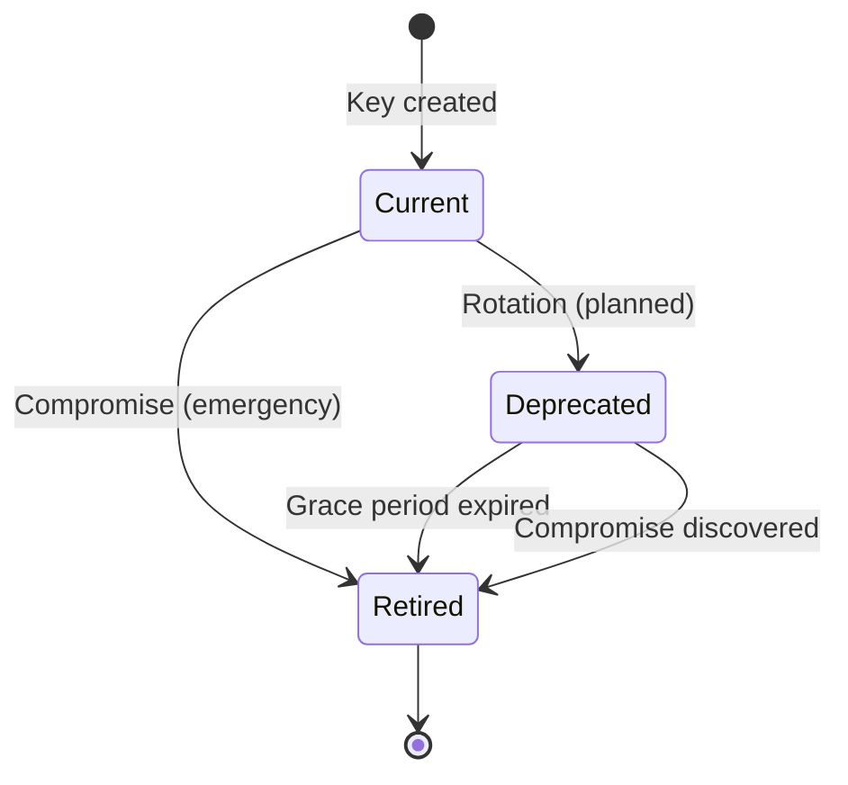

# Revocation Model — ZKP Credential Platform

**Version:** 1.0  
**Last Updated:** 2026-02-11  
**Status:** Active

---

## 1. Overview

This document specifies the revocation strategy for policy credentials in the ZKP platform. The chosen model balances security, UX, and operational complexity.

**Chosen Model:** **Model C — Key-Level Revocation + Short TTL**

---

## 2. Model Comparison

| Model | Revocation Mechanism | Complexity | UX Impact | Security |
|-------|---------------------|------------|-----------|----------|
| A | Revocation list (centralized) | High | Low | Good |
| B | Credential versioning | Low | High | Poor |
| **C** | **Key-level + Short TTL** | **Medium** | **Medium** | **Excellent** |

**Why Model C?**
- ✅ Instant invalidation on key compromise
- ✅ No centralized revocation list (privacy)
- ✅ Bounded blast radius (short TTL)
- ✅ Grace period for rotation (not compromise)
- ✅ Operationally realistic

---

## 3. Credential Lifecycle

### Issuance
1. User authenticates with eID provider (MitID, BankID)
2. IdentityService issues signed credential:
   - `issuedAt`: Current timestamp
   - `expiresAt`: `issuedAt + TTL` (24-72 hours)
   - `nbf` (not-before): Current timestamp (optional, for immediate validity)
   - `keyId`: Current signing key ID
3. Credential stored in browser extension

### Validation Window
```
Valid if:
  - now >= credential.issuedAt (not issued in future)
  - now >= credential.nbf (if present)
  - now < credential.expiresAt (not expired)
  - |now - credential.issuedAt| <= 5 minutes (clock skew tolerance)
  - signingKey.status != Retired (key not compromised)
```

### Expiry
- **TTL:** 24-72 hours (configurable per policy)
- **Auto-refresh:** Extension prompts user 2 days before expiry
- **Graceful degradation:** Expired credentials trigger re-auth flow

---

## 4. Revocation Scenarios

### Scenario 1: Key Rotation (Planned)

**Trigger:** Regular key rotation (e.g., quarterly)

**Process:**
1. Admin rotates key via `KeyManagementService.RotateKeyAsync()`
2. Old key marked `Deprecated` (status change logged)
3. **Grace period:** 7 days (old key still verifies credentials)
4. After grace period: Old key auto-retired
5. Credentials issued during grace period remain valid until `expiresAt`

**Impact:** Zero — users unaffected

---

### Scenario 2: Key Compromise (Emergency)

**Trigger:** Security incident detected (key leak, breach, unauthorized access)

**Process:**
1. **Detection:** Security team identifies compromise
2. **Action:** Admin calls `KeyManagementService.RetireKeyAsync(keyId, reason, actor)`
   - Key status: `Current/Deprecated → Retired`
   - **No grace period** (immediate effect)
   - Audit log entry created (signed, immutable)
3. **Validation:** `ValidationService` rejects ALL credentials from retired key
4. **User impact:** Credentials invalid immediately
5. **Recovery:** Users re-authenticate to get new credentials

**RTO (Recovery Time Objective):** < 5 minutes (from detection to key retirement)  
**RPO (Recovery Point Objective):** 0 (no data loss)

**Blast Radius:**
- Credentials from compromised key: **Invalidated immediately**
- Credentials from other keys: **Unaffected**

---

### Scenario 3: Stolen Credential (Device Theft)

**Trigger:** User reports device stolen

**Defense Mechanisms:**
1. **Short TTL:** Credential expires within 24-72 hours
2. **Device binding:** Credential includes `deviceTag`, proof generation requires matching tag
3. **Panic button:** User can remotely wipe credentials (future: remote wipe API)

**Impact:** Bounded by TTL + device binding

---

## 5. Key States & Transitions



**State Definitions:**

| State | Can Sign? | Can Verify? | Grace Period | Use Case |
|-------|-----------|-------------|--------------|----------|
| `Current` | ✅ Yes | ✅ Yes | N/A | Active signing key |
| `Deprecated` | ❌ No | ✅ Yes (within grace) | 7 days | Rotation in progress |
| `Retired` | ❌ No | ❌ No | None | Compromised or expired |

---

## 6. Validation Rules

### Clock Skew Tolerance

**Rule:** `|validator.now - credential.issuedAt| <= 5 minutes`

**Rationale:** Prevents replay attacks with far-future timestamps

**Implementation:**
```csharp
var now = DateTime.UtcNow;
var skew = Math.Abs((now - credential.IssuedAt).TotalMinutes);

if (skew > 5)
{
    return new ValidationResult
    {
        Valid = false,
        ReasonCode = ReasonCode.ClockSkewExceeded
    };
}
```

**Test Cases:**
- ✅ Credential issued 3 min ago → Accept
- ❌ Credential issued 10 min in future → Reject
- ❌ Credential issued 8 min ago (validator clock -6 min) → Reject

---

### Not-Before (nbf) Claim

**Purpose:** Prevent credentials from being used before a specific time

**Validation:**
```csharp
if (credential.NotBefore.HasValue && now < credential.NotBefore.Value)
{
    return new ValidationResult
    {
        Valid = false,
        ReasonCode = ReasonCode.NotYetValid
    };
}
```

**Use Case:** Delayed activation (rare, mostly for testing)

---

### Retired Key Rejection

**Critical Invariant:** Credentials from retired keys MUST be rejected, even within TTL

**Validation:**
```csharp
var signingKey = await _keyManagement.GetKeyByIdAsync(credential.KeyId);

if (signingKey == null || signingKey.Status == KeyStatus.Retired)
{
    return new ValidationResult
    {
        Valid = false,
        ReasonCode = ReasonCode.RetiredKeyUsed
    };
}
```

**Test Cases:**
- ✅ Current key → Accept
- ✅ Deprecated key (within grace) → Accept
- ❌ Retired key (even if credential not expired) → Reject
- ❌ Unknown key → Reject

---

## 7. Operational Procedures

### Key Compromise Response

**RTO:** 5 minutes  
**RPO:** 0 (no data loss)

**Steps:**
1. **Detect:** Security team confirms compromise
2. **Retire:** Admin executes: `RetireKeyAsync(keyId, "Security incident SI-2026-001", "admin@example.com")`
3. **Audit:** Verify audit log entry created
4. **Notify:** Alert users via extension banner (future enhancement)
5. **Monitor:** Track re-auth rate, ensure users can obtain new credentials

**Rollback:** None (key retirement is irreversible)

---

### Key Rotation (Planned)

**Frequency:** Quarterly (or as needed)

**Steps:**
1. **Rotate:** Admin executes: `RotateKeyAsync()`
2. **Verify:** Check old key status = `Deprecated`
3. **Wait:** Grace period (7 days)
4. **Auto-retire:** Cron job runs `AutoRetireExpiredKeysAsync()`
5. **Cleanup:** Archive retired keys (keep audit log)

**Impact:** Zero downtime, zero user impact

---

## 8. Security Considerations

### Attack: Replay with Old Credential

**Scenario:** Attacker captures credential, replays after expiry

**Defense:**
1. `expiresAt` validation → Reject expired credentials
2. Short TTL (24-72h) → Bounded window

**Residual Risk:** Low (window limited by TTL)

---

### Attack: Clock Manipulation

**Scenario:** Attacker sets victim's clock +10 hours

**Defense:**
1. Clock skew tolerance (±5 min) → Reject outliers
2. Server-side timestamp validation (authoritative)

**Residual Risk:** Very Low (server clock is authoritative)

---

### Attack: Compromised Key Usage After Retirement

**Scenario:** Attacker uses compromised key after retirement

**Defense:**
1. Retired key status checked on EVERY validation
2. No grace period for retired keys
3. Immediate rejection

**Residual Risk:** None (guaranteed by security invariant)

---

## 9. Metrics & Monitoring

**Key Metrics:**
- Key rotation count (per quarter)
- Grace period expiries (auto-retired keys)
- Retired key usage attempts (security signal)
- Average credential TTL
- Re-auth rate (after key retirement)

**Alerts:**
- Retired key usage attempt → Critical alert
- Clock skew validation failures (>1% of requests) → Warning
- Key older than 6 months → Info (rotation overdue)

---

## 10. Future Enhancements

**Possible improvements (not in MVP):**
- Remote credential wipe API (panic button v2)
- Dynamic TTL based on risk score
- Credential suspension (temporary revocation)
- Multi-key signing (redundancy)

---

## References

- [Threat Model](file:///e:/Ny%20mappe%20%282%29/EWalletSystem/docs/threat-model.md)
- [Security Invariants](file:///e:/Ny%20mappe%20%282%29/EWalletSystem/docs/security-invariants.md)
- [Protocol Specification](file:///e:/Ny%20mappe%20%282%29/EWalletSystem/docs/protocol.md)

---

**Approval Status:** Ready for implementation  
**Reviewed By:** Security team  
**Version:** 1.0 (2026-02-11)
